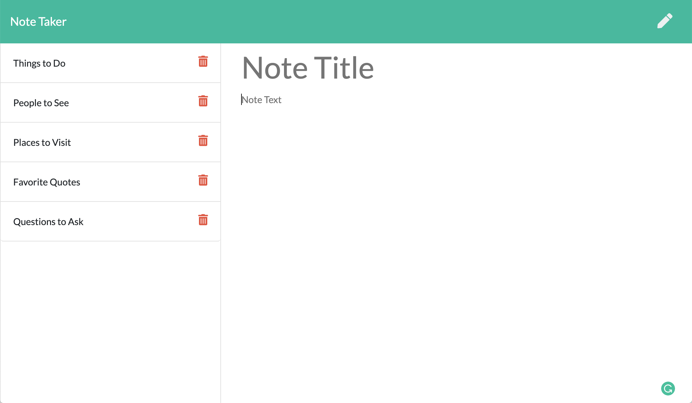

# Note Taker
An application that can be used to write, save, and delete notes. This application utilizes an Express backend and saves and retrieves note data from a JSON file.

       




## User Story
```
As a user
I want to be able to write and save notes, as well as delete notes I've written before
So that I can organize my thoughts and keep track of tasks I need to complete
```


## Functionality
```
WHEN a user visits the main path
THEN they are greeted with an entry page

WHEN the user clicks the Get Started button
THEN they are taken to the notes page where they can see all of their previous notes in the sidebar

WHEN the user clicks on any note in the sidebar
THEN the full note displays for them

WHEN the user enters a title and text for a new note
THEN a save button appears

WHEN the user clicks the save button
THEN the note is added to the sidebar and the JSON file with all notes

WHEN the user clicks the trash button next to any note
THEN the note is deleted from the sidebar and the JSON file with all notes

WHEN the user leaves the application and comes back later
THEN all of their notes are still there for them
```


## Table of Contents    
* [Credits](#credits) 
* [Questions](#questions) 
* [Donate](#donate)
* [License](#license)   


## Credits
The application frontend was already created by Trilogy Education Services for the purpose of this project. The backend of this web application wouldn't run without [Express](https://www.npmjs.com/package/express).


## Questions
If you have any questions, feel free to find me at:
* Email: laurensiminski@gmail.com
* Website: https://siminski.co
* Github: [@siminski](https://github.com/siminski)


## Donate
Appreciate this code? Say thanks with a coffee:

[](https://ko-fi.com/W7W21YVJJ)


## License
Copyright (c) 2020 Lauren Siminski.